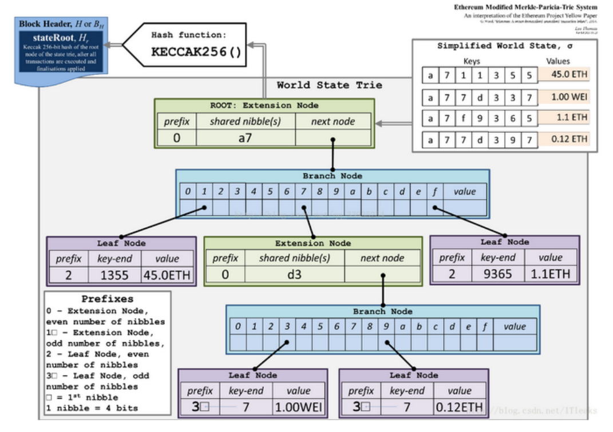

# [Research-report-on-MPT](https://github.com/NuoJin1229/Research-report-on-MPT)
关于MPT的研究报告
**（主要内容都在研究报告里面，此处仅做简要介绍）**

------

## 简述
在以太坊中，一种经过改良的默克尔树非常关键，是以太坊数据安全与效率的保障，此树在以太坊中称之为 MPT（默克尔压缩前缀树）。 MPT 全称是 Merkle Patricia Trie 也叫 Merkle Patricia Tree，是 Merkle Tree 和Patricia Tree 的混合物。 Merkle Tree(默克尔树) 用于保证数据安全，Patricia Tree(基数树,也叫基数特里树或压缩前缀树) 用于提升树的读写效率。

## 官方给出的图解

## 具体贡献说明及贡献排序

代码思路与完成：[宋诺金](https://github.com/NuoJin1229)
