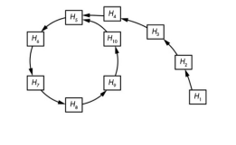
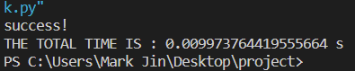
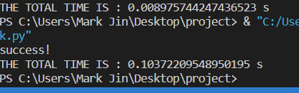
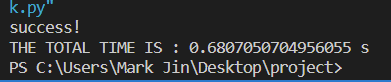
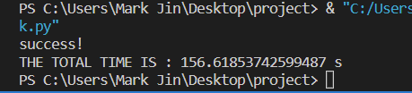

# SM3 Rho攻击
## 攻击思路
Rho攻击是HASH函数的一种较为常见的攻击手段，其攻击思路主要为：通过不断的对结果进行加密操作，直到得出一个"环"，总体类似于希腊字母"Rho"。而对于环内环外交界处的点上，在环内和环外各有一个明文，其加密后的密文为交界处文字。此时我们就相当于找到了一对碰撞。这就是Rho攻击的整体思路，下图中展示了Rho攻击的流程图：

这里可以看出H4和H10有相同的哈希值H5，并且H4和H5并不相同，所以我们此时用Rho攻击找到了一对碰撞。
## 代码思路
对于Rho攻击而言，我们应该首先随机找到一个数据作为起始点(H1)，并记录，然后对H1进行不断的SM3哈希，然后将哈希值与之前所存的哈希值进行对比，如果发现哈希值相同，并且明文与H1不同，则说明我们形成了一个Rho"环"，并且此时已经找到了碰撞；如果此时与H1相同，则说明形成了一个圆环，并没有找到相应的碰撞原像，此时说明寻找失败。与此同时，为了方便退出，我们设置了一个num变量，如果超出num值的寻找次数，则报碰撞失败。
## 代码结果
### 原像大小为2字节时:

### 原像大小为4字节时:

### 原像大小为6字节时:

### 原像大小为8字节时:

