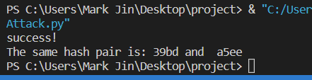

# SM3 Birthday攻击
### 实现者：金周泉
## 攻击思路
生日攻击在密码学中也是较为常见的一种手段，其可以用$\sqrt{n}$的复杂度以50$\%$的概率求出一对碰撞。
## 代码思路
首先我们需要随机找一个原像，并求出其HASH函数，之后再通过枚举，将并与其进行对比，若发现相同则停止枚举，结束；为方便设置，我们加入了num变量，若枚举次数超过num则停止。
## 运行截图

