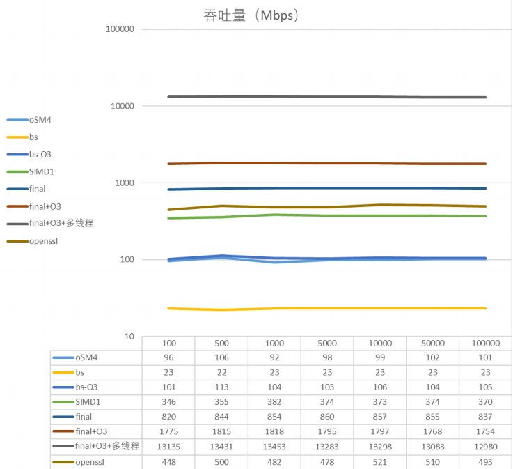
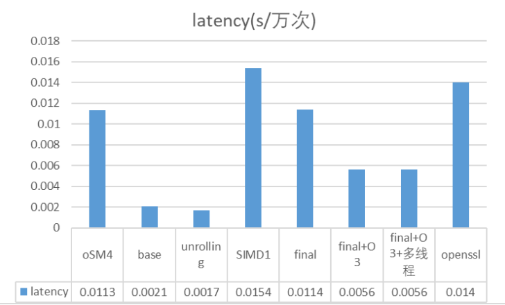

# [Optimization-of-SM4-algorithm](https://github.com/NuoJin1229/Optimization-of-SM4-algorithm)

优化之后的SM4算法

------

## 项目代码说明

朴素的SM4算法，与[SM4-algorithm](https://github.com/NuoJin1229/SM4-algorithm)做对照，体现出优化对于性能的提升。

> 本代码为2022年上半年的计算机系统原理课程的实验三（SM4的软件实现与优化）的实验报告的部分截取。该实验由本*README.md*作者宋诺金所在的计算机系统原理小组成员共同完成。
> - 该课程小组的全体组员为：**宋诺金**、**王子兴**、**金周泉**、隋佩航、王超然。（字体加粗者为本课程的小组成员）

## 运行指导 

在Visual Studio 2022中打开[SM4.sln](SM4.sln)，先Ctrl+Shift+B后Ctrl+F5。

## 代码运行全过程截图
### 实验效果

### 运行分析

## 具体贡献说明及贡献排序

代码思路与完成：[宋诺金](https://github.com/NuoJin1229)
